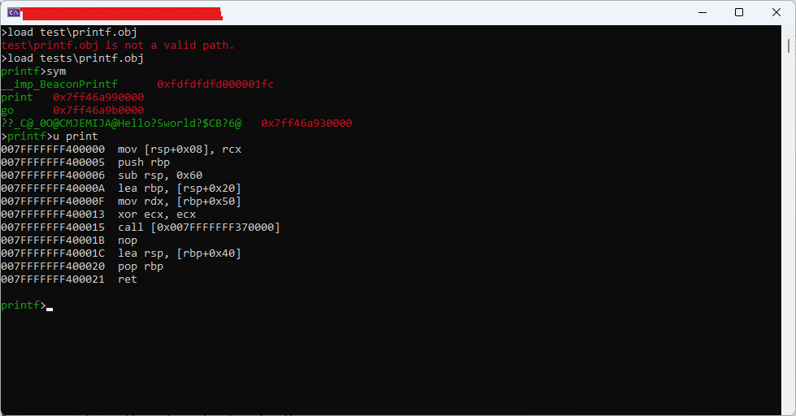

# beacondbg

***NOTE***
I'm working on this project in my free time.. i'm trying to integrate [FTXUI](https://github.com/ArthurSonzogni/FTXUI) to improve the the interaction with this project.. but it takes me times because I never used.

CMAKE file right now it doesn't work.. still using VS 2022 CE for development, but I will switch as soon to CMAKE (so it will be possible to build from your cmdline).

***Breakpoint***
It's almost impossible to debug a single thread inside the same application, without playing with thread context, trace flags and VEH.. The only support available is via Windows Debug API (available for a process), so, I'm isolating the `beacon` outside `beacondbg` to be able to inject into a remote process and to control the debugging experience via RPC, for now it's only in local process via direct call.


This is a simple debugger to test/debug a Cobalt Strike beacon without using Cobalt Strike.
Some APIs accessed directly from the beacon are monitored (to track the beacon memory allocation, thread creation etc.).

The beacon is injected directly into the memory of the beacondbg (in the current version) so, before running any unknown code on your system be aware of risks (***you'll do under your responsability!***).

## Disassemble
The disassemble engine is provided by Zydis. Don't forget to clone submodule via
```shell
git clone --recurse-submodules https://github.com/wolfcod/beacondbg.git
```

After you loaded a module in memory, you can use `sym` command to enumerate symbols (only static functions).


## How to use
```shell
~ ./beacondbg
beacondbg> load yourbeacon.obj
beacondbg> run entrypoint
```

# TO BE IMPLEMENTED
Cobalt Strike Beacons are encoded in a binary sequence extracted through `BeaconDataParse`and underlying APIs.

Supported Data:
- strings: "This is a simple string"
- unicode strings: L"This is a simple unicode string"
- integers: 1111 or 0x11111
- shorts: 1111s or 0x11111s
- buffer: b"sequence of bytes"

From command line:
- --integer value
- --short value
- --ascii "string"
- --unicode "unicode string"
- --hex hexdump as argument
- --in input file as argument

- --output save arguments in an output file
- --input use file as input for arguments

- --beacon beacon to debug/emulate

The generation of arguments can be done via `bofpack` tool included in the repo.

## Debugger command
- .load: Load a beacon (OBJ file) in memory
- args: Set arguments for the beacon "strings", L"unicode" h"hexdump" b"file as input" sNUMBER iNUMBER
- bp: Normal breakpoint (actually, set a break only on Windows API)
- bl: List of breakpoints
- bc: Clear a breakpoint
- g: continue (or run)
- k: stack trace
- r: registers
- d: Data dump

## Components
- [Templatized C++ Command Line Parser](https://tclap.sourceforge.net)
- [Cobalt Strike Beacon Header](https://github.com/Cobalt-Strike/bof_template/blob/main/beacon.h)
- beacon: Emulate the beacon engine.. which can be injected locally or remote

## Output
The beacon output is directly printed on your prompt.
If you need to test a beacon which requires admin privileges, you need to run `beacondbg` with admin privileges, or to run a beacon to gain more privileges before running the final beacon.

## Notes

COFFLoader (coff directory) for speeding up the process are Copyright of [trustedsec](https://trustedsec.com).
The original source code is available on [GitHub](https://github.com/trustedsec/COFFLoader).\

The source code is distributed to create a MOCK of this project.
